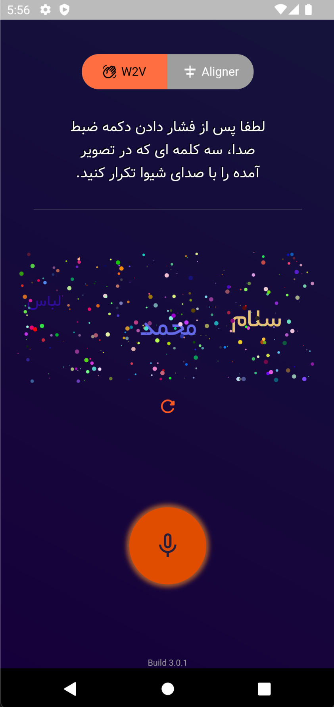

Voice Captcha Verification
==========================

This project was a part of the Pezhvaak startup, co-founded by [Dr. Amir Najafi](https://scholar.google.com/citations?hl=en&user=N_zYPC0AAAAJ&view_op=list_works&sortby=pubdate) and [Dr. Abolfazl Motahari](https://scholar.google.com/citations?user=rJ-biB0AAAAJ&hl=en). In this project, 3 words are shown to the user and to verify that a humen-operator is using the system, the user should speak the words.
This app uses two methods for speech-to-text, one is with a BERT model, developed by the Pezhvaak team, and one with the aligner developed by Google.

# Usage

In order to use this project, you should install the [Flutter SDK](https://flutter.dev/). However, you can download the apk output from [here](https://raw.githubusercontent.com/theablemo/Voice-Captcha-Verification/master/output/app-arm64-v8a-release.apk).

# Demo

Following are some screenshots of the app:

*Main page*
